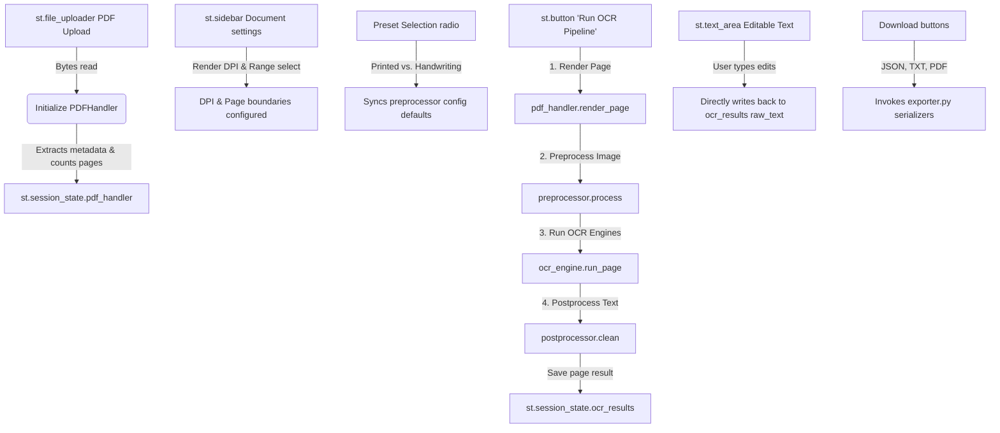

# OCR Pipeline & PDF Reader - Code Guide

This document provides a technical walkthrough of the local Tesseract OCR + PDF Reader Streamlit application. It documents the modular architecture, Streamlit UI interaction triggers, and the detailed data transformations across the processing pipeline.

---

## 📂 1. Python Module Documentation

The application follows a modular architecture separating the Streamlit interface layer from core document processing, image transformation, OCR extraction, and exporting tasks.

```
ocr_app/
├── app.py                  # Streamlit Interface, State, and Coordination
└── src/
    ├── pdf_handler.py      # PDF parsing, metadata reading, and page rasterization
    ├── preprocessor.py     # Image cleaning & computer vision pipelines
    ├── ocr_engine.py       # Tesseract OCR wrappers and confidence analysis
    ├── postprocessor.py    # Text cleaning, unicode normalization, and structure formatting
    └── exporter.py         # Serialization to TXT, JSON, and PDF formats
```

---

### 🖥️ `app.py`
* **Purpose**: Serves as the main entry point, coordinator, and user interface layer. It manages application lifecycle, initializes session states, builds configurations, coordinates batch runs, and renders previews.
* **Key Components & Functions**:
  * `_auto_detect_tesseract()`: Scans common Windows filesystem locations (Program Files, LocalAppData, AppData) for `tesseract.exe` to configure paths automatically without user intervention.
  * **Session State Management**: Keeps track of `pdf_handler`, `ocr_results` (page index mapping to `PageResult` objects), `current_page_idx`, `last_uploaded_file_name`, and `batch_log`.
* **Design Decisions**:
  * **Low-DPI Previews**: Renders page previews at `min(dpi, 150)` to prevent browser lag and out-of-memory crashes on high-DPI rasterization, while using the full requested DPI (e.g., 300+) for Tesseract.
  * **Interactive Updates**: Employs unique session-state keys for text areas (`text_area_page_<idx>`) allowing users to edit OCR text inline. Changes are written directly back to the active page's `PageResult`.

---

### 📄 `src/pdf_handler.py`
* **Purpose**: Handles PDF file validation, metadata querying, and converts vector PDF pages into raster images.
* **Key Classes**:
  * `PDFHandler`:
    * `__init__(file_bytes: bytes)`: Validates that the uploaded file starts with the `%PDF` header magic bytes.
    * `_load_pdf()`: Initializes a `pypdf.PdfReader` instance to retrieve total pages and metadata dictionary (Title, Author, Creator).
    * `render_page(page_number: int, dpi: int)`: Resolves local Poppler binary path (`src/poppler/.../bin` if present on Windows) and rasterizes a specific 0-indexed page to a PIL Image using `pdf2image.convert_from_bytes`.
* **Design Decisions**:
  * **On-Demand Page Rendering**: Rather than rendering all pages on load (which degrades performance on large documents), pages are rendered lazily as requested by the UI viewport or during active OCR processing.

---

### 🛠️ `src/preprocessor.py`
* **Purpose**: Employs computer vision (OpenCV) to clean up scanning artifacts, skew, and text noise before feeding pages to Tesseract.
* **Key Classes & Presets**:
  * `PreprocessorConfig`: Dataclass containing flags and parameters for grayscale conversion, denoising, binarization methods, contrast enhancement (CLAHE), deskew thresholds, upscaling bounds, and border cropping.
  * `PRINTED_PRESET` / `HANDWRITING_PRESET`: Preset configs optimized for clean typeset fonts vs. unevenly lit, lower contrast handwriting.
  * `ImagePreprocessor`:
    * `_sauvola_threshold()`: Implements Sauvola local thresholding ($T = m \cdot (1 + k \cdot (\frac{s}{R} - 1))$) for robust handwriting separation.
    * `_deskew()`: Uses Otsu binarization to detect text orientation, calculates minimum area bounding rectangles, and rotates the image to align lines horizontally.
    * `_remove_borders()`: Finds external contours to identify bounding boxes of text blocks, cropping out dark scanned margins.
    * `process(image: PIL.Image.Image)`: Orchestrates the sequential pipeline.
* **Design Decisions**:
  * **Pipeline Sequencing**: Runs transformations in a strict mathematical order: Grayscale $\rightarrow$ Denoising $\rightarrow$ CLAHE Contrast $\rightarrow$ Deskewing (prevents skewing binarization artifacts) $\rightarrow$ Binarization (Otsu/Adaptive/Sauvola) $\rightarrow$ Bicubic Upscaling $\rightarrow$ Border Crop.

---

### 🔬 `src/ocr_engine.py`
* **Purpose**: Wraps Tesseract executable calls, handles runtime executable validation, and computes word-level extraction.
* **Key Classes**:
  * `OCRConfig`: Configuration mapping language packs, PSM (Page Segmentation Mode), OEM (OCR Engine Mode), and rendering DPI.
  * `PageResult`: Structured dataclass returning the extracted `raw_text` string, word-level coordinates dataframe (`word_data`), overall average word confidence, and processing speed metadata.
  * `OCREngine`:
    * `validate_installation()`: Queries `pytesseract.get_tesseract_version()` to ensure Tesseract is in the system execution PATH.
    * `validate_languages(lang_str: str)`: Checks if the requested languages are actively installed inside the `tessdata` folder.
    * `run_page(image: PIL.Image.Image, page_number: int)`: Calls Tesseract twice; once for overall text via `image_to_string` and once for structured coordinates via `image_to_data` outputting a Pandas DataFrame.
* **Design Decisions**:
  * **Confidence Calculations**: Computes average page confidence using only valid words (Tesseract returns `-1` for spaces or non-text blocks; these are filtered out via `word_data[word_data["conf"] > -1]["conf"].mean()`).

---

### 📝 `src/postprocessor.py`
* **Purpose**: Cleans up text errors, normalizes character encoding, and reconstructs paragraph structures.
* **Key Classes**:
  * `TextPostprocessor`:
    * `clean(text: str)`: Executes text transformations.
    * `merge_to_document()`: Assembles multi-page results into a single formatted report with header markers (`[--- Page X ---]`).
* **Design Decisions**:
  * **Hyphenation Restoration**: Rejoins words split across line breaks using regex (e.g., matching word characters ending with a hyphen followed by a newline: `(\w+)-\n(\w+)` $\rightarrow$ `\1\2\n`).
  * **Unicode NFC Normalization**: Prevents character mapping inconsistencies (like accent marks splitting from their base letter) by standardizing to NFC format.

---

### 📥 `src/exporter.py`
* **Purpose**: Converts page-level extraction states into distributable files.
* **Key Components**:
  * `OCRPDF(FPDF)`: Custom FPDF class overriding the `footer()` method to print centered page numbers automatically.
  * `export_txt()`: Encodes text as UTF-8-BOM (`utf-8-sig`) to ensure correct character rendering when opened in Microsoft Notepad.
  * `export_json()`: Serializes metadata (page count, confidence, file source, and processing parameters) along with clean page text.
  * `export_pdf()`: Compiles text pages using a true local TrueType font (`DejaVuSans.ttf`) to ensure full multi-lingual character coverage (such as Hindi glyphs) instead of falling back to Latin-only standard Helvetica.

---

## ⚙️ 2. Streamlit UI Interaction Points & Backend Triggers

The following flowchart lists the direct UI interaction points in Streamlit, their respective session state updates, and the backend engine functions they invoke.



| UI Element | Widget / State | Input / Action | Backend Trigger & Logic |
| :--- | :--- | :--- | :--- |
| **PDF Uploader** | `st.file_uploader` | Upload `.pdf` file | Instantiates `PDFHandler(file_bytes)`. Resets `ocr_results`, `current_page_idx`, and logs in session state. |
| **Render DPI** | `st.slider` | Integer (150-600) | Configures quality of rasterization. Higher values increase accuracy but increase execution time and memory footprint. |
| **Page Range Selection** | `st.selectbox` / `st.number_input` | Select All/Single/Range | Compiles list of page indices to loop over during the processing pipeline run. |
| **Tesseract Path Override** | `st.text_input` | String path | Updates global environment command: `pytesseract.pytesseract.tesseract_cmd = path`. |
| **Document Style Preset** | `st.radio` | Select "Printed" or "Handwritten" | Switches preset values for the image preprocessor (e.g., Otsu binarization for printed text; Sauvola thresholding for handwriting). |
| **Run OCR Button** | `st.button` | Click event | Executes `validate_installation()`, loops over selected pages, renders pages, applies pre-processing, calls Tesseract, post-processes text, and updates state. |
| **Text Area Editor** | `st.text_area` | User edits characters | Captures edited text area value and updates `st.session_state.ocr_results[current_page].raw_text` in real-time. |
| **Download Buttons** | `st.download_button` | Click event | Runs `export_txt`, `export_json`, or `export_pdf` mapping from current state items into downloaded bytes. |

---

## 🔄 3. PDF Upload $\rightarrow$ OCR $\rightarrow$ Display Data Flow & Data Types

The diagram below details the transformation cycle from raw binary upload to final user-editable output, detailing the exact data types at each transitional stage.

```
[ Uploaded File ]
       │
       ▼ (Type: bytes)
┌────────────────────────────────────────────────────────┐
│ PDFHandler Ingestion                                   │
│ - Starts with %PDF validation                          │
│ - Reads structures via pypdf.PdfReader                 │
└────────────────────────────────────────────────────────┘
       │
       ▼ (Type: PIL.Image.Image, Mode: RGB)
┌────────────────────────────────────────────────────────┐
│ Page Rasterization (pdf2image.convert_from_bytes)     │
│ - Resolves poppler binary                              │
│ - Renders at user DPI (e.g. 300 DPI)                   │
└────────────────────────────────────────────────────────┘
       │
       ▼ (Type: np.ndarray, Shape: (H, W, 3), Dtype: uint8)
┌────────────────────────────────────────────────────────┐
│ Computer Vision Preprocessing (ImagePreprocessor)     │
│ - cv2.cvtColor(img, cv2.COLOR_RGB2BGR)                 │
│ - cv2.fastNlMeansDenoising                             │
│ - cv2.createCLAHE                                      │
│ - cv2.getRotationMatrix2D & cv2.warpAffine (Deskew)    │
│ - cv2.adaptiveThreshold / Otsu (Binarization)         │
│ - cv2.resize (Bicubic Upscaling)                       │
│ - cv2.findContours (Border Crop)                       │
└────────────────────────────────────────────────────────┘
       │
       ▼ (Type: PIL.Image.Image, Mode: L [Grayscale/Binary])
┌────────────────────────────────────────────────────────┐
│ OCR Extraction (OCREngine)                             │
│ - pytesseract.image_to_string()                        │
│ - pytesseract.image_to_data()                          │
└────────────────────────────────────────────────────────┘
       │
       ├─────────────────────────────────────┐
       ▼ (Type: str)                         ▼ (Type: pd.DataFrame)
┌─────────────────────────────┐       ┌─────────────────────────────┐
│ Raw Text Block              │       │ Word Coordinates & Conf     │
│ - Lines of text             │       │ - level, page_num, left     │
│ - Special character spacing │       │ - top, width, height, conf  │
└─────────────────────────────┘       └─────────────────────────────┘
       │                                     │
       ▼                                     ▼
┌────────────────────────────────────────────────────────┐
│ Instantiating PageResult                               │
│ - Computes average confidence: Validated float          │
│ - Measures processing speed: ms float                  │
└────────────────────────────────────────────────────────┘
       │
       ▼ (Type: PageResult Object)
┌────────────────────────────────────────────────────────┐
│ Postprocessing Clean (TextPostprocessor)               │
│ - unicodedata.normalize ("NFC")                        │
│ - unicodedata.category filter                          │
│ - Regex space compression                              │
│ - Hyphen rejoining                                    │
└────────────────────────────────────────────────────────┘
       │
       ▼ (Type: str)
┌────────────────────────────────────────────────────────┐
│ Streamlit Viewport Display                             │
│ - Renders text in editable st.text_area                │
│ - Updates st.session_state on user key-press           │
└────────────────────────────────────────────────────────┘
       │
       ▼ (Type: bytes)
┌────────────────────────────────────────────────────────┐
│ Serialization & Export (exporter.py)                   │
│ - export_txt()    -> utf-8-sig encoded bytes           │
│ - export_json()   -> json string utf-8 bytes           │
│ - export_pdf()    -> fpdf binary stream bytes          │
└────────────────────────────────────────────────────────┘
```
