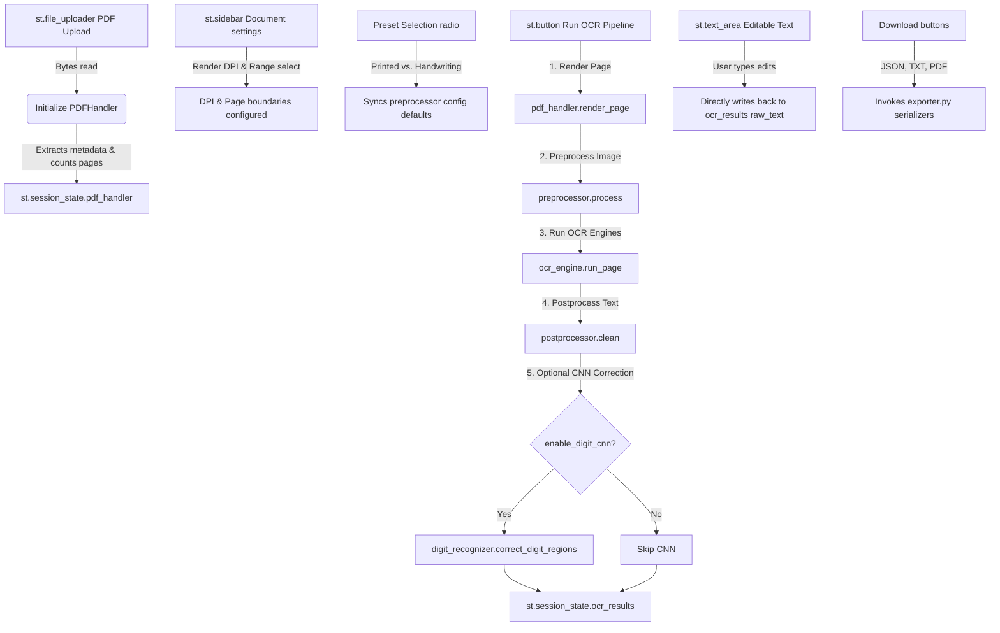

# OCR Pipeline & PDF Reader — Code Guide

This document provides a complete technical walkthrough of the local Tesseract OCR + PDF Reader Streamlit application. It documents the modular architecture, all modules (including the new CNN digit recognizer), Streamlit UI interaction triggers, and the detailed data transformations across the full processing pipeline.

---

## 📂 1. Python Module Documentation

The application follows a strict modular architecture — the Streamlit interface layer is fully decoupled from core document processing, image transformation, OCR extraction, digit correction, and export tasks.

```
ocr_app/
├── app.py                       # Streamlit Interface, State, and Coordination
└── src/
    ├── pdf_handler.py           # PDF parsing, metadata reading, and page rasterization
    ├── preprocessor.py          # Image cleaning & computer vision pipelines
    ├── ocr_engine.py            # Tesseract OCR wrappers and confidence analysis
    ├── postprocessor.py         # Text cleaning, unicode normalization, and structure formatting
    ├── digit_recognizer.py      # [NEW] ONNX CNN handwritten digit corrector
    ├── exporter.py              # Serialization to TXT, JSON, and PDF formats
    └── models/
        └── mnist-8.onnx         # [AUTO-DOWNLOADED] MNIST CNN weights (~26 KB)
```

---

### 🖥️ `app.py`
* **Purpose**: Main entry point, coordinator, and user interface layer. Manages application lifecycle, initializes session states, builds configurations, coordinates batch runs, invokes the CNN corrector, and renders previews.
* **Key Functions & Components**:
  * `_auto_detect_tesseract()`: Scans common Windows filesystem locations (`C:\Program Files\Tesseract-OCR`, `LOCALAPPDATA`, `AppData`, etc.) for `tesseract.exe` to configure `pytesseract.pytesseract.tesseract_cmd` automatically without requiring user input.
  * **Session State Management**: Persists `pdf_handler`, `ocr_results` (page-index → `PageResult` mapping), `current_page_idx`, `last_uploaded_file_name`, and `batch_log` across Streamlit reruns.
  * **CNN Integration**: After each `engine.run_page()` + `postprocessor.clean()` call, optionally constructs a `DigitRecognizer` and calls `correct_digit_regions()` on the result. Corrections are logged in the batch summary table under a "CNN Fixes" column.
* **Design Decisions**:
  * **Low-DPI Previews**: Renders page previews at `min(dpi, 150)` to prevent browser lag and OOM crashes, while using the full user-selected DPI (e.g. 300–600) for Tesseract inference.
  * **Interactive Text Editing**: Uses unique session-state keys per text area (`text_area_page_<idx>`) so users can edit OCR output inline. Changes are written directly back to `st.session_state.ocr_results[page].raw_text`.
  * **Defensive Upload Handling**: `last_uploaded_file_name` is reset to `None` when the file uploader is cleared, preventing stale state on re-upload. A `None`-guard on `pdf_handler` stops further execution before any attribute access.

---

### 📄 `src/pdf_handler.py`
* **Purpose**: Handles PDF file validation, metadata querying, and converts vector PDF pages into raster images for the OCR pipeline.
* **Key Classes**:
  * `PDFHandler`:
    * `__init__(file_bytes: bytes)`: Validates that the uploaded file starts with the `%PDF` magic bytes header. Raises `ValueError` for invalid files.
    * `_load_pdf()`: Initializes a `pypdf.PdfReader` instance to read total page count and metadata dictionary (Title, Author, Creator).
    * `render_page(page_number: int, dpi: int) → PIL.Image.Image`: Resolves the local Poppler binary path (`src/poppler/.../bin` if bundled on Windows) and rasterizes a specific 0-indexed page to a PIL Image via `pdf2image.convert_from_bytes`.
* **Design Decisions**:
  * **On-Demand Page Rendering**: Pages are rendered lazily only when requested by the UI viewport or during active OCR batch processing, avoiding memory pressure from pre-rendering large documents.
  * **Bundled Poppler Fallback**: On Windows, Poppler binaries are bundled inside `src/poppler/` so no system-level `PATH` configuration is needed.

---

### 🛠️ `src/preprocessor.py`
* **Purpose**: Employs OpenCV computer vision pipelines to clean scanning artifacts, correct skew, enhance contrast, and remove noise before feeding pages to Tesseract.
* **Key Classes & Presets**:
  * `PreprocessorConfig`: Dataclass with flags and parameters for grayscale conversion, denoising strength, binarization method, CLAHE contrast enhancement, deskew angles, bicubic upscaling bounds, and border cropping.
  * `PRINTED_PRESET`: Uses Otsu global binarization, light denoising, no contrast boosting — optimized for clean, uniformly lit typeset fonts.
  * `HANDWRITING_PRESET`: Uses Sauvola local thresholding, stronger denoising, CLAHE contrast, and deskew — optimized for unevenly lit, low-contrast handwriting.
  * `ImagePreprocessor`:
    * `_sauvola_threshold()`: Implements Sauvola local thresholding $T = m \cdot (1 + k \cdot (\frac{s}{R} - 1))$ for robust handwriting separation without destroying thin connecting strokes (Devanagari Shirorekha, cursive loops).
    * `_deskew()`: Uses Otsu binarization to detect text orientation, calculates minimum-area bounding rectangles via `minAreaRect`, and applies `warpAffine` rotation to align text lines horizontally.
    * `_remove_borders()`: Finds external contours via `findContours` to compute the text content bounding box, cropping out dark scanned margins that can confuse Tesseract's layout analysis.
    * `process(image: PIL.Image.Image) → PIL.Image.Image`: Orchestrates the full sequential pipeline.
* **Design Decisions**:
  * **Pipeline Sequencing**: Strictly ordered: Grayscale → Denoising → CLAHE Contrast → Deskewing → Binarization (Otsu / Adaptive / Sauvola) → Bicubic Upscaling → Border Crop. Deskewing must run before binarization because skew detection relies on pixel intensity gradients that binarization would destroy.

---

### 🔬 `src/ocr_engine.py`
* **Purpose**: Wraps Tesseract executable calls, validates the runtime environment, and computes structured word-level extractions with confidence metrics.
* **Key Classes**:
  * `OCRConfig`: Configuration dataclass mapping language packs (`language`), Page Segmentation Mode (`psm`), OCR Engine Mode (`oem`), and rendering DPI.
  * `PageResult`: Structured dataclass returned per page, containing: `raw_text` (str), `word_data` (pd.DataFrame with bounding box + confidence per word), `confidence` (float — average over valid words), and `processing_ms` (float — wall-clock OCR time).
  * `OCREngine`:
    * `validate_installation()`: Calls `pytesseract.get_tesseract_version()` to confirm Tesseract is accessible. Raises `RuntimeError` with a clear message on failure.
    * `validate_languages(lang_str: str) → List[str]`: Checks all language codes in the `+`-separated string against installed `tessdata` packs. Returns a list of missing codes so the UI can warn the user.
    * `run_page(image: PIL.Image.Image, page_number: int) → PageResult`: Calls Tesseract twice — `image_to_string` for raw text extraction and `image_to_data` for structured word coordinates (as a Pandas DataFrame).
* **Design Decisions**:
  * **Dual Tesseract Calls**: Two separate Tesseract invocations per page (one for text, one for data) ensures the `word_data` DataFrame always has full bounding-box coordinates available for downstream CNN digit correction.
  * **Confidence Filtering**: `word_data[word_data["conf"] > -1]["conf"].mean()` filters out Tesseract's `-1` sentinel values (assigned to whitespace and non-text blocks) before computing the page confidence score.

---

### 🔢 `src/digit_recognizer.py` *(New — Plan 7)*
* **Purpose**: Provides offline, local CNN-based correction for handwritten English numeral digits (0–9) in regions where Tesseract reported low confidence. Runs entirely on CPU via ONNX Runtime. No internet connection required after the first model download.
* **Model**: Uses the **MNIST-8 ONNX model** from the [ONNX Model Zoo](https://github.com/onnx/models) — a LeNet-style convolutional network (~26 KB) trained on 60,000 MNIST handwritten digit samples.
* **Key Functions & Classes**:
  * `_download_model() → bool`: On first use, downloads `mnist-8.onnx` (~26 KB) from the ONNX Model Zoo GitHub to `src/models/` and caches it permanently. Returns `False` and logs an error if the download fails without corrupting the cache.
  * `_preprocess_digit_image(img) → np.ndarray`: Converts any PIL image crop to the MNIST model input format: grayscale → 28×28 Lanczos resize → float32 normalization to [0, 1] → MNIST convention (white digit on black background, inverted if needed) → shape `(1, 1, 28, 28)`.
  * `DigitRecognizer`:
    * `__init__(confidence_threshold: float)`: Sets the Tesseract confidence threshold below which digit regions are eligible for CNN re-evaluation.
    * `_ensure_session()`: Lazily loads the `onnxruntime.InferenceSession` (only on first inference call). Downloads the model if not already cached.
    * `predict_digit(img: PIL.Image.Image) → Tuple[int, float]`: Runs a single digit image through the CNN. Applies softmax over raw logits to produce a probability distribution. Returns `(predicted_class, confidence)` where confidence is in `[0.0, 1.0]`.
    * `correct_digit_regions(original_text, word_data, page_image, min_cnn_confidence) → Tuple[str, List[dict]]`: Main correction pipeline — filters Tesseract `word_data` rows where: (a) Tesseract confidence < threshold, (b) word text matches a digit/numeric pattern. For each eligible single-character digit, crops the bounding box from the page image, runs CNN prediction, and replaces the Tesseract output if CNN confidence ≥ `min_cnn_confidence` and CNN disagrees with Tesseract.
* **Design Decisions**:
  * **Single-Character Only**: Correction is limited to single-digit tokens (`len(tess_text) == 1 and tess_text.isdigit()`). Multi-digit sequences are left to Tesseract to avoid introducing segmentation errors.
  * **Threshold Guard**: The `min_cnn_confidence` parameter (default 0.6) prevents low-certainty CNN guesses from overriding Tesseract. Corrections only fire when the CNN is clearly confident.
  * **Lazy Model Loading**: The ONNX session is not loaded at class construction time — only on the first `predict_digit` or `correct_digit_regions` call. This avoids startup delays when the user has CNN disabled.
  * **Non-destructive**: Returns both the corrected string and a detailed corrections log (original token, corrected token, Tesseract confidence, CNN confidence, pixel position), enabling full traceability.

---

### 📝 `src/postprocessor.py`
* **Purpose**: Cleans text errors, normalizes character encoding, and reconstructs paragraph structures from raw Tesseract output.
* **Key Classes**:
  * `PostprocessorConfig`: Dataclass with flags for hyphenation fixing, extra whitespace removal, NFC unicode normalization, empty line removal, and control character stripping.
  * `TextPostprocessor`:
    * `clean(text: str) → str`: Executes all enabled text transformations in sequence.
    * `merge_to_document(results: List[PageResult]) → str`: Assembles multi-page results into a single formatted report with section headers (`[--- Page X ---]`).
* **Design Decisions**:
  * **Hyphenation Restoration**: Rejoins words split across line-breaks using regex — matches word characters ending with `-` followed by a newline: `(\w+)-\n(\w+)` → `\1\2\n`.
  * **Unicode NFC Normalization**: Prevents character mapping inconsistencies (e.g., composite accent characters splitting into base letter + combining mark) by standardizing the entire output to Unicode Canonical Decomposition, followed by Canonical Composition (NFC).

---

### 📥 `src/exporter.py`
* **Purpose**: Converts page-level `PageResult` extraction states into distributable file formats.
* **Key Components**:
  * `OCRPDF(FPDF)`: Custom FPDF subclass that overrides `footer()` to print centered page numbers automatically on every exported PDF page.
  * `export_txt(results, postprocessor) → bytes`: Merges all page texts using `TextPostprocessor.merge_to_document()` and encodes as `UTF-8-BOM` (`utf-8-sig`) for correct character rendering when opened in Microsoft Notepad.
  * `export_json(results, original_filename) → bytes`: Serializes metadata (page count, per-page confidence, file source, processing parameters) alongside clean page text into a structured JSON document.
  * `export_pdf(results, original_filename) → bytes`: Compiles text pages using a bundled TrueType font (`DejaVuSans.ttf`) to ensure full multi-lingual character coverage (Hindi glyphs, special characters) rather than falling back to Latin-only Helvetica.

---

## ⚙️ 2. Streamlit UI Interaction Points & Backend Triggers

The following flowchart maps UI interaction points to their session-state updates and the backend engine functions they invoke.



| UI Element | Widget / State | Input / Action | Backend Trigger & Logic |
| :--- | :--- | :--- | :--- |
| **PDF Uploader** | `st.file_uploader` | Upload `.pdf` file | Instantiates `PDFHandler(file_bytes)`. Resets `ocr_results`, `current_page_idx`, `last_uploaded_file_name`, and logs in session state. Defensive `None` guard prevents `AttributeError` on re-upload. |
| **Render DPI** | `st.slider` | Integer (150–600) | Configures rasterization quality. Higher values increase accuracy but increase memory and execution time. |
| **Page Range Selection** | `st.selectbox` / `st.number_input` | All / Single / Range | Compiles list of page indices to loop over during OCR pipeline execution. |
| **Tesseract Path Override** | `st.text_input` | String path | Updates `pytesseract.pytesseract.tesseract_cmd`. Auto-detection fills this field on startup if Tesseract is found. |
| **Document Style Preset** | `st.radio` | Printed vs. Handwritten | Switches preset values for the image preprocessor (Otsu binarization for printed; Sauvola for handwriting). |
| **OCR Engine Mode (OEM)** | `st.radio` | 1 or 3 | Sets `OCRConfig.oem`. OEM 1 (LSTM only) performs better on handwriting; OEM 3 (LSTM + Legacy) is the default for printed text. |
| **Page Segmentation Mode (PSM)** | `st.selectbox` | Integer 3–13 | Sets `OCRConfig.psm`. PSM 7/8/13 are best for handwritten forms; PSM 3 is default for full page layout. |
| **🔢 Digit Enhancement** | `st.checkbox` + `st.slider` | Toggle + threshold % | Enables `DigitRecognizer`. Threshold slider controls which low-confidence Tesseract digit regions are re-evaluated by the MNIST CNN. |
| **Run OCR Button** | `st.button` | Click event | Executes `validate_installation()`, loops over selected pages, renders, preprocesses, OCRs, postprocesses, optionally CNN-corrects, and updates session state. Batch summary shows "CNN Fixes" column when enabled. |
| **Text Area Editor** | `st.text_area` | User edits characters | Captures edited value and updates `st.session_state.ocr_results[current_page].raw_text` in real-time. |
| **Download Buttons** | `st.download_button` | Click event | Runs `export_txt`, `export_json`, or `export_pdf` serializing current session state to bytes. |

---

## 🔄 3. Full PDF → OCR → CNN → Display Data Flow

```
[ Uploaded File ]
       │
       ▼ (Type: bytes)
┌────────────────────────────────────────────────────────┐
│ PDFHandler Ingestion                                   │
│ - Validates %PDF magic bytes header                    │
│ - Reads page count & metadata via pypdf.PdfReader      │
└────────────────────────────────────────────────────────┘
       │
       ▼ (Type: PIL.Image.Image, Mode: RGB)
┌────────────────────────────────────────────────────────┐
│ Page Rasterization (pdf2image.convert_from_bytes)     │
│ - Resolves local Poppler binary (src/poppler/)         │
│ - Renders at user DPI (default: 300)                   │
└────────────────────────────────────────────────────────┘
       │
       ▼ (Type: np.ndarray, Shape: (H, W, 3), Dtype: uint8)
┌────────────────────────────────────────────────────────┐
│ Computer Vision Preprocessing (ImagePreprocessor)     │
│ - cv2.cvtColor(img, cv2.COLOR_RGB2BGR)                 │
│ - cv2.fastNlMeansDenoising                             │
│ - cv2.createCLAHE (contrast enhancement)               │
│ - cv2.getRotationMatrix2D & cv2.warpAffine (deskew)    │
│ - cv2.adaptiveThreshold / Otsu / Sauvola (binarize)    │
│ - cv2.resize (bicubic upscaling)                       │
│ - cv2.findContours (scan border crop)                  │
└────────────────────────────────────────────────────────┘
       │
       ▼ (Type: PIL.Image.Image, Mode: L [Grayscale/Binary])
┌────────────────────────────────────────────────────────┐
│ OCR Extraction (OCREngine)                             │
│ - pytesseract.image_to_string()  → raw text            │
│ - pytesseract.image_to_data()    → word bounding boxes │
└────────────────────────────────────────────────────────┘
       │
       ├─────────────────────────────────────┐
       ▼ (Type: str)                         ▼ (Type: pd.DataFrame)
┌─────────────────────────────┐       ┌─────────────────────────────┐
│ Raw Text Block              │       │ Word Coordinates & Conf     │
│ - Lines of text             │       │ - level, page_num, left     │
│ - Special character spacing │       │ - top, width, height, conf  │
└─────────────────────────────┘       └─────────────────────────────┘
       │                                     │
       ▼                                     ▼
┌────────────────────────────────────────────────────────┐
│ PageResult Instantiation                               │
│ - Computes average confidence (valid words only)       │
│ - Records processing speed in ms                       │
└────────────────────────────────────────────────────────┘
       │
       ▼ (Type: PageResult)
┌────────────────────────────────────────────────────────┐
│ Postprocessing (TextPostprocessor)                     │
│ - unicodedata.normalize("NFC")                         │
│ - unicodedata.category filter (strip control chars)    │
│ - Regex space compression                              │
│ - Hyphen rejoining across line breaks                  │
└────────────────────────────────────────────────────────┘
       │
       ▼ (Type: str — cleaned text)
┌────────────────────────────────────────────────────────┐
│ [OPTIONAL] CNN Digit Correction (DigitRecognizer)      │
│ - Filter word_data rows: conf < threshold & digit text │
│ - For each eligible single digit:                      │
│   ┌──────────────────────────────────────────────────┐ │
│   │ Crop bounding box from page image (PIL.crop)     │ │
│   │ _preprocess_digit_image(): grayscale → 28×28 →  │ │
│   │   float32 normalized → shape (1,1,28,28)         │ │
│   │ ONNX Runtime inference (mnist-8.onnx)            │ │
│   │ Softmax(logits) → (predicted_class, confidence)  │ │
│   └──────────────────────────────────────────────────┘ │
│ - Replace token in text if CNN conf ≥ min_cnn_conf     │
│ - Append to corrections log                            │
└────────────────────────────────────────────────────────┘
       │
       ▼ (Type: str — optionally digit-corrected)
┌────────────────────────────────────────────────────────┐
│ Streamlit Viewport Display                             │
│ - Renders text in editable st.text_area                │
│ - Updates session_state on user keypress               │
│ - Shows CNN correction count badge if fixes applied    │
└────────────────────────────────────────────────────────┘
       │
       ▼ (Type: bytes)
┌────────────────────────────────────────────────────────┐
│ Serialization & Export (exporter.py)                   │
│ - export_txt()   → utf-8-sig encoded bytes             │
│ - export_json()  → JSON string utf-8 bytes             │
│ - export_pdf()   → fpdf2 binary stream bytes           │
└────────────────────────────────────────────────────────┘
```

---

## 📦 4. External Dependencies Reference

| Package | Version | Purpose |
|:---|:---|:---|
| `streamlit` | ≥1.35 | Web UI framework |
| `pytesseract` | ≥0.3.10 | Tesseract OCR Python wrapper |
| `pdf2image` | ≥1.17 | PDF page rasterization via Poppler |
| `pypdf` | ≥4.0 | PDF metadata reading |
| `Pillow` | ≥10.0 | Image I/O and manipulation |
| `opencv-python-headless` | ≥4.9 | Computer vision preprocessing pipeline |
| `numpy` | ≥1.26 | Array operations for image tensors |
| `pandas` | ≥2.0 | Word-level OCR data as DataFrames |
| `fpdf2` | ≥2.7 | PDF export with TrueType font support |
| `onnxruntime` | ≥1.17 | **[NEW]** CPU inference for MNIST digit CNN |
